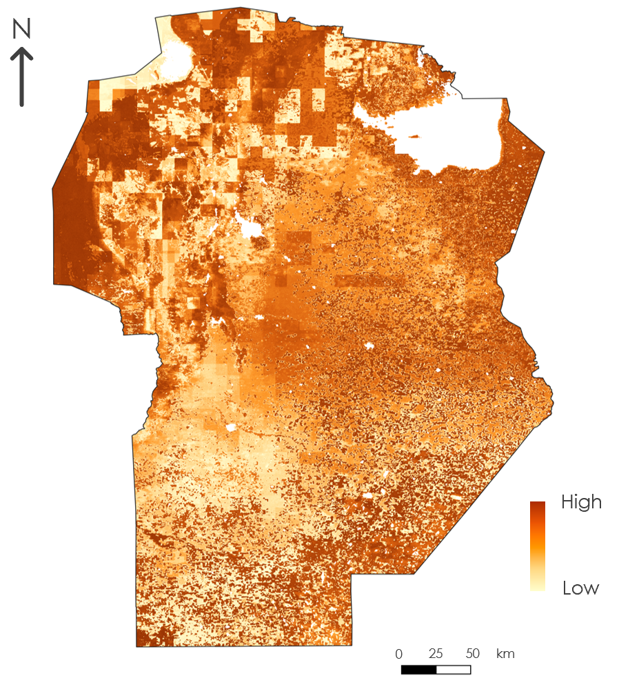

# NASA DEVELOP – Wildfire Risk Assessment (Córdoba, Argentina)

## Project Overview

Córdoba, Argentina has experienced increasingly severe wildfires in recent years, burning more than 300,000 hectares in 2020 alone. I evaluated the feasibility of using NASA Earth Observations (soil moisture, temperature, vegetation, and terrain) to identify key drivers of wildfire occurrence in the region. Using logistic regression and random forest modeling, I produced a wildfire probability map and found NDVI and precipitation to be the strongest predictors for the 2020 fire season. I applied multi-sensor NASA EO data to support the Instituto Nacional de Tecnología Agropecuaria (INTA) in improving wildfire risk assessment and informing future mitigation strategies.

## Featured Map

*Caption: Final wildfire risk map, developed using random forest. The darker areas indicate a higher probability of wildfires while the lighter areas show a lower probability.*

## Data Sources

- **[MODIS (Terra/Aqua)](https://modis.gsfc.nasa.gov/)** - Burned Area Product, Land Surface Temperature (LST), Evapotranspiration (ET), & Normalized Difference Vegetation Index (NDVI)
- **[GPM IMERG](https://gpm.nasa.gov/data/imerg)** - Precipitation
- **[SMAP](https://smap.jpl.nasa.gov/)** - Soil Moisture
- **[SRTM](https://www.earthdata.nasa.gov/data/instruments/srtm)** - Elevation & Slope
- **Spatial Analysis for Conservation and Sustainability lab (University of Wisconsin-Madison)** - WUI Mapping

## Methods and Workflow

## Key Results

## Deliverables

## Repository Structure

## How to Use/Run Code

## Credits

## Legal Notice
NASA DEVELOP deliverables included in this repository are provided solely for portfolio and demonstration purposes. These materials remain the property of the NASA DEVELOP Program and partnering organizations. No re-licensing or redistribution is permitted.
